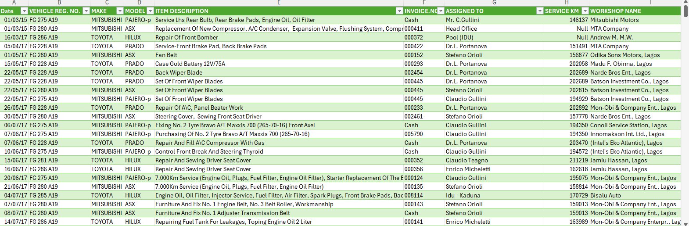

# 🚆 Vehicle Maintenance Data Cleaning Project

## 📌 Overview

This project focuses on cleaning and preparing Nigerian Railway vehicle maintenance data using Excel and Power Query. The goal was to transform a raw, messy dataset into a clean, structured format suitable for further analysis and reporting. 

The dataset includes records of maintenance activities with fields such as dates, vehicle registration numbers, service kilometers, item descriptions, workshop names, and costs.

---

## 🎯 Objective

- Clean and prepare the dataset by resolving missing values and inconsistencies
- Standardize formatting for key columns like dates, registration numbers, and costs
- Separate and organize combined fields for clearer analysis
- Ensure the dataset is analysis-ready and free of duplicate or misleading entries

---

## 🛠 Tools Used

- **Excel (Power Query)**
- **Excel Functions**: `Text.Trim`, `Text.Proper`, `ReplaceValue`, `Split Column`, `Group By`, `IF`, etc.

---

## 🔍 Key Cleaning Steps

### 1. Date Formatting
Converted all inconsistent date formats to a standard `dd/mm/yyyy` format using Power Query’s built-in date transformation.

### 2. Standardizing Vehicle Registration Numbers
Used text functions to trim, split, reorder, and recombine registration numbers into a uniform pattern (e.g., `"FG 275 A19"`).

### 3. Splitting Make and Model
Separated combined make/model entries into two distinct columns for easier filtering and grouping.

### 4. Handling Missing Values
Replaced missing `Service KM` values with nulls for clarity. Standardized missing or irregular `Invoice No.` entries (e.g., “petty cash”) as `"Cash"`.

### 5. Invoice Number Formatting
Formatted numeric invoice numbers as six-digit strings (e.g., `000123`) and replaced non-numeric entries appropriately.

### 6. Cleaning Maintenance Costs
Converted the cost column to a numeric format with two decimal places to support calculations.

### 7. Standardizing Text Fields
Applied trimming and proper casing to fields like `Workshop Name`, `Item Description`, and `Assigned To` for consistency.

### 8. Duplicate Review
Grouped by Vehicle Registration Number to identify and manually review possible duplicates. Valid multiple maintenance entries were preserved.

---

## ✅ Final Outcome

- A clean, analysis-ready dataset suitable for dashboards and further reporting
- All entries are standardized, complete, and consistently formatted
- Duplicate records were carefully reviewed and handled
- This cleaned dataset is now suitable for further analysis and reporting, providing insights into the maintenance operations of the Nigerian Railway

---

## 📁 Project Files

- [Nigerian Railway Vehicle Maintenance Dataset](./nigerian_railway_vehicle_maintenance.xlsx)
- [Nigerian Railway Vehicle Dataset](./nigerian_railway_vehicle.xlsx)
- 

---

## 👩🏽‍💻 About Me

**Temitope Ebo**  
Aspiring Data Analyst | Excel • SQL • Power BI  
📧 [ebotemitopeserah@gmail.com](mailto:ebotemitopeserah@gmail.com)  
🌐 [GitHub Portfolio](https://github.com/temilyst)
